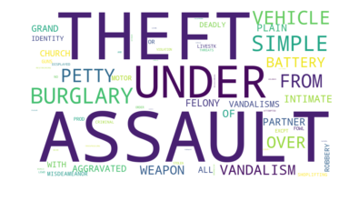
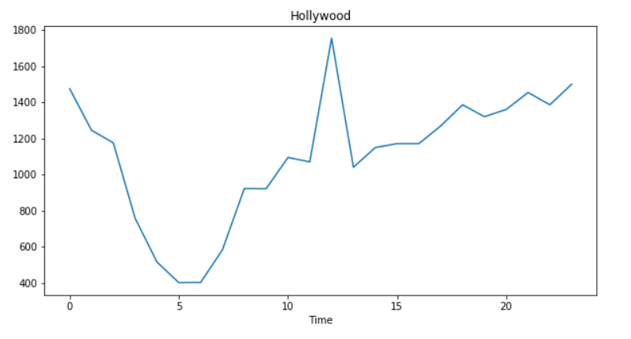

# <도입 & 필요성>
1. 3년간의 데이터 분석 결과 범죄발생 지역 및 밀집도가 비슷하다. 따라서 사람들에게 어느정도 신뢰를 줄 수 있다고 본다.

2. intro

3. 인력배치를 효율적으로 할 수 있도록~~

등 3가지로 시작

<본론>

 
 크게보이는 단어 읽기
 
1.  2017-2019년간 Hollywood에서 범죄 발생 지도 오전6시(하루 중 crime 발생 최저),오후 12시(최고)

 

# 3년간 데이터기 때문에 많아 보일 수 있다.

 

3. 지역별 가장 빈도 높은 범죄

4. 범죄가 잘 일어나지 않는 지역(발생빈도가 가장 적은) => 안전지역으로 여행적합

<결과>
- 

